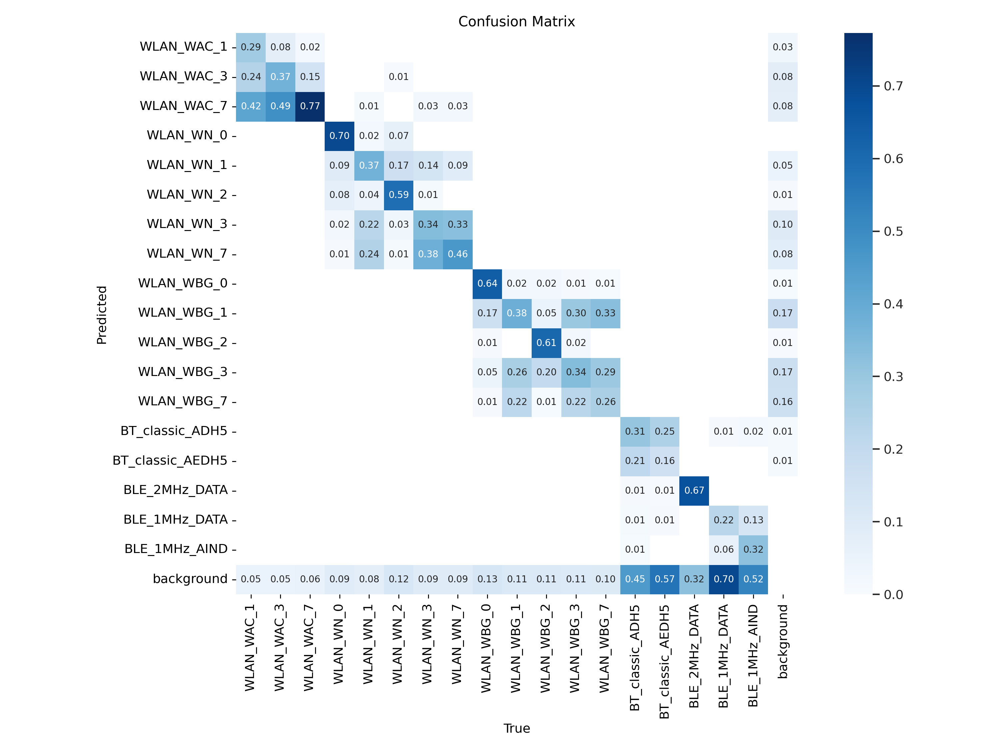

# RF Classification

This github repo used 2 methods to classify signals from spectrograms.

- YOLOv5
- AFC (iCARL)

You may request the models (.pt/.pth files), documentations and reports from me at kokchinyi01@gmail.com.

Note: You may ignore `data_utils` (not updated) and `extra` within this repo.

## Dataset

The Dataset I used is from [Spectrogram Data Set for Deep-Learning-Based RF Frame Detection](https://www.mdpi.com/2306-5729/7/12/168). Click here to download the [dataset](https://fordatis.fraunhofer.de/handle/fordatis/287) [80 gb]. You may also download it using this command (Linux).

```bash
$ wget https://fordatis.fraunhofer.de/bitstream/fordatis/287/1/spectrogram_training_data_20220711.zip
```

### Dataset Structure 

- merged_data
  - bw_125e6
    - *.npy (the format of the file is in npy even if there isn't any file type) **Data is in IQ format**
    - *.csv (contains extra information of each individual frame)
  - bw_25e6/bw_45e6/bw_60e6
- results
  - *_marked.png (boxed images)
  - *.png (unboxed images)
  - *.txt (labels for each signals)
 

Keep in mind that this dataset only label the signals into WLAN, Collision and BT. Please use the necessary steps below to extract out the 18 different signals from the csv files and labels.

The 18 different signals are:
| WLAN_WAC_1 | WLAN_WN_3 | WLAN_WBG_7 |
|------------ |------------ |------------------ |
| WLAN_WAC_3 | WLAN_WN_7 | BT_classic_ADH5 |
| WLAN_WAC_7 | WLAN_WBG_0 | BT_classic_AEDH5 |
| WLAN_WN_0 | WLAN_WBG_1 | BLE_2MHz_DATA |
| WLAN_WN_1 | WLAN_WBG_2 | BLE_1MHz_DATA |
| WLAN_WN_2 | WLAN_WBG_3 | BLE_1MHz_AIND |

### Steps to extract

Using the `extract.py` module in `yolov5/data_utils`, execute the following commands:

**Step 1**:
```
$ python extract.py --mode classes18 --yaml <yaml path> --data <path of the 80gb spectrogram file> --dest <destination of results> --duplicate-imgs <Boolean> 
```
Refer to documentations for more settings/params. (Ref to Docs for Scaling/Slicing of imgs)

**Step 2** (Recommandation for YOLOv5):\
For YOLOv5 to work, ensure that the Dataset is in this format, (the folders need to be named images and labels)
- dataset
  - images
  - labels
 
Since step 1 have extracted the labels into the `dest`/`labels` folder already, step 2 will aim to copy all the files from the `data` path to `images`
```
$ python extract.py --mode false --duplicate-imgs <path of labels> --data <path of the 80gb spectrogram file>
```

**Step 3** (For AFC):\
This step will aim to extract out all the signals imgs from the frames. The outcome is a directory as seen below: 
- dataset
  - WLAN_WAC_1
  - ...
  - BLE_1MHz_AIND
The sub-directories of dataset will be automatically generated, `dest` is `dataset` in this case.

```
$ python extract.py --mode getsignals --yaml <yaml path> --dest <destination of results, ie the dataset> --imgs-path <path of the images seen in step 2> --labels-path <path of the labels seen in step 2>
```


 


# YOLOv5

This is a transfer learning model from the main [YOLOv5 model](https://github.com/ultralytics/yolov5). You may also visit [link](https://github.com/ultralytics/yolov5/wiki/Train-Custom-Data) for more information in creating your own dataset for YOLOv5. I will only outline the steps I did for my dataset.

Note: The yolov5 folder in this repo contains other functions used to train this custom dataset. Please use the YOLOv5 given in this repo.

The training process is detailed below:
```

```

The results for the **sliced** dataset is below.




To accomodate slice and no slice function, I have accomodated a function for this. This is a parser argument as seen below.

```
$ python detection.py
```

KIV

# AFC

AFC model is a **CLASSIFICATION** model. [Repo link](https://github.com/kminsoo/AFC)

Note: The AFC folder in this repo contains other functions used to train this **custom** dataset such as auto scaling of images to 224x224. Please use the AFC given in this repo.

It is necessary to extract the signals images out from each frame. The steps are mentioned in **Steps to extract** (step 3).


To train the model, you may use this:

```
$ python -minclearn --options options/AFC/AFC_cnn_custom18.yaml options/data/custom18_order.yaml --initial-increment 10 --increment 2 --fixed-memory --memory-size 20000 --device 0 --label AFC_cnn_custom_10steps --data-path sample_signals --metadata-path custom_split
```

However, you may add in `save-model` and `dump-predictions` as well.

Considering a 10-2-2-2-2 split for the dataset of 18 signals, the results are as follow:


|       | initial_10 | step_12 | step_14 | step_16 | step_18 |
| ----- | ---------- | ------- | ------- | ------- | ------- |
| total | 0.733      | 0.733   | 0.667   | 0.614   | 0.593   |

Keep in mind that the results are saved in a .json file. So use `AFC/results_analysis.ipynb` to generate the graphs.

# References

- Jocher, G. (2020). YOLOv5 by Ultralytics (Version 7.0) [Computer software]. https://doi.org/10.5281/zenodo.3908559
- Kang, Minsoo and Park, Jaeyoo and Han, Bohyung. (2022) CVPR. Class-Incremental Learning by Knowledge Distillation with Adaptive Feature Consolidation. [Link](https://arxiv.org/pdf/2204.00895.pdf)
